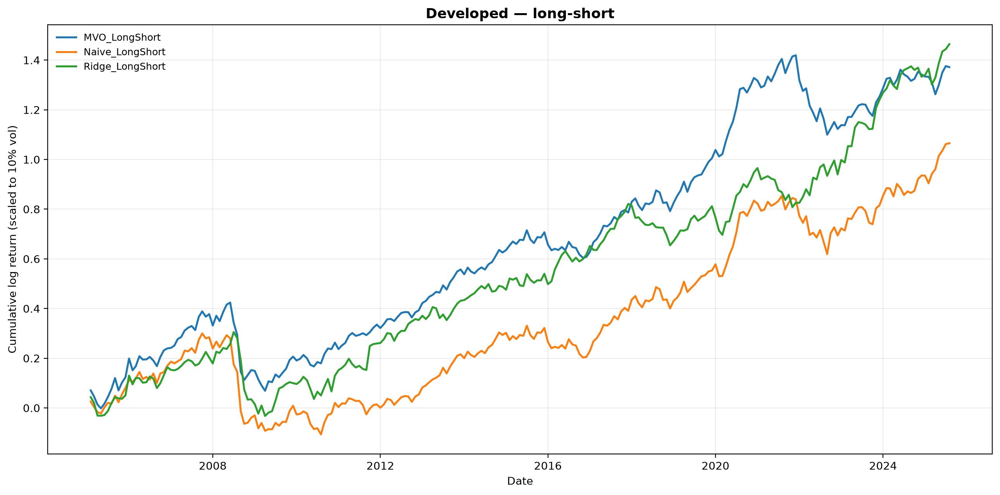
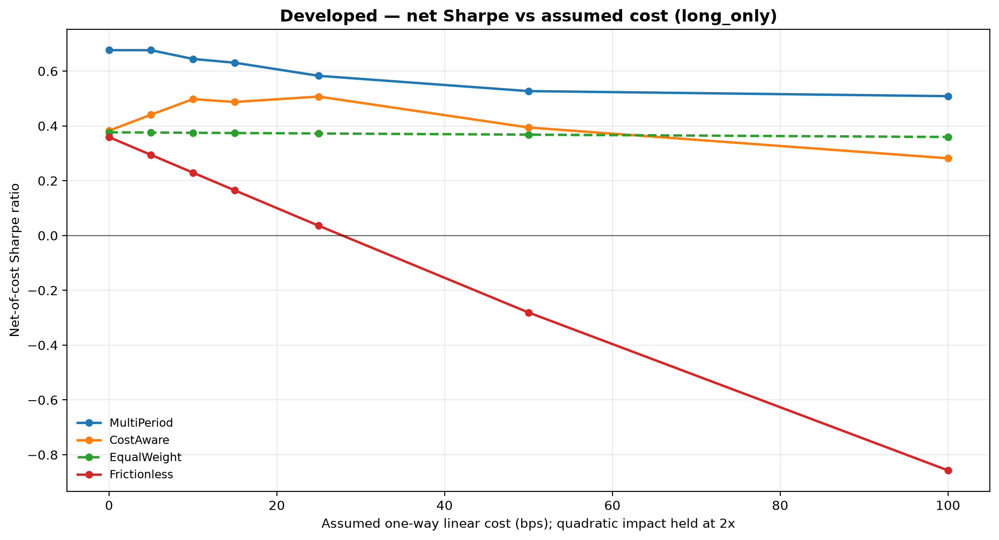

# Macro-Regime Tactical Asset Allocation

Detect the prevailing macro regime from 120+ FRED-MD indicators (PCA → two-step
KMeans), then tilt a global-equity book toward what has historically paid off in
that regime. On a walk-forward backtest the best regime-aware long-only book earns
**11.2% a year against an equal-weight benchmark's 5.6%** in MSCI developed, very
close to 2×. Emerging is a different story: the best long-only book there is a
different model (mean-variance, 10.4% against 6.0%), and the Ridge forecaster that
wins in developed trails the benchmark.

Every macro input is lagged one month before it is used. FRED-MD's vintage for
month M is not published until the middle of M+1, so a book positioned for month M
can only see M-1. That one line changes the answer everywhere, and most of what
follows is the shape of the result after it.

A second layer asks whether any of it survives trading costs. Position sizing is
reformulated as a **convex program with transaction costs inside the objective**
(cvxpy, MOSEK-first solver policy with an open-source conic fallback) and solved
over a receding horizon on a Markov-projected regime forecast. With the lag in
place the receding-horizon book wins at **every** cost level in developed markets,
from 0 to 100bps, and its net Sharpe degrades gently — 0.68 to 0.51 across a 20×
move in the cost assumption — while the frictionless book falls from 0.36 to
**−0.86**. See [Trading costs](#trading-costs-the-convex-layer).

> **Correction (2026-10-02): the regime labels were fitted in-sample.** The detector is
> fitted once on 1959–2023 and the backtest trades 2005–2025 on those labels, so for
> 2005–2023 each month's regime came from clusters that had seen the following years.
> The publication lag above fixed a different leak. Refitting the detector every January
> on data through the previous November ([`scripts/walkforward_regimes.py`](scripts/walkforward_regimes.py))
> changes the regime-aware rows and leaves MVO and equal weight untouched, as it must:
>
> | Sharpe (ann. return %) | developed, as published | developed, walk-forward | emerging, walk-forward |
> |---|--:|--:|--:|
> | Ridge long-only | 0.645 (11.2) | **0.348 (6.8)** | 0.217 (5.0) |
> | Naive long-only | 0.359 (6.4) | 0.591 (9.3) | **0.618 (11.9)** |
> | Naive long-short | 0.518 (10.2) | **0.768 (12.9)** | **0.733 (14.6)** |
> | MVO long-only (no regimes) | 0.591 (10.6) | 0.591 (10.6) | 0.478 (10.4) |
> | Equal weight | 0.377 (5.6) | 0.377 (5.6) | 0.310 (6.0) |
>
> The headline "11.2% against 5.6%" does not survive: the Ridge book it describes falls
> below equal weight. The plain regime-mean forecaster gets better, and leads both
> universes long-short. In developed long-only, regimes add nothing over mean-variance.
>
> The cost-aware layer, re-run the same way ([`scripts/walkforward_costs.py`](scripts/walkforward_costs.py)),
> keeps its developed result: MultiPeriod net Sharpe 0.697 / 0.616 / 0.503 at 0 / 10 /
> 100 bps (published: 0.676 / 0.644 / 0.508), and the frictionless book falls to −0.275
> at 100 bps rather than −0.86. In emerging it does not: at 10 bps the frictionless book
> leads (0.557 against MultiPeriod's 0.374), and MultiPeriod wins only at 100 bps (0.460).
> The tables below are the published, in-sample-regime run; read them with this note.


## The idea

Equities don't have one return distribution — they have several, depending on the
macro backdrop (broad expansion, sluggish growth, an inflation scare, an outright
collapse). If you can label the current regime from the data, you can size positions
using the return/risk profile that regime tends to produce, instead of one blended
average that fits none of them.

This project does exactly that, end to end: build a stationary macro panel, cluster
it into regimes, forecast regime-conditional returns, and run a proper walk-forward
backtest against an equal-weight benchmark across developed and emerging equities.

## Results

Walk-forward, monthly, 48-month lookback. The MSCI sector panels run 2001-01 to
2025-10 (10 sectors each); intersected with the FRED-MD regime dates that is 296
months, less the 48-month lookback and the one-month publication lag, leaving **247
out-of-sample months**. Sharpe/Sortino are ratios; the rest are percentages.

These are raw strategy returns — nothing here is volatility-scaled, which is why the
Ann. Vol column ranges from 15% to 24% and why the Sharpe column is the one to read
across rows. (The *equity-curve charts* are vol-targeted to a common 10% so the
shapes are comparable; the tables are not.)

**Developed markets**

| Strategy | Sharpe | Sortino | Ann. Return | Ann. Vol | Max DD | Hit Rate |
|---|---|---|---|---|---|---|
| Ridge Long-Short | **0.71** | 1.02 | 13.98 | 19.66 | 51.67 | 61.1 |
| MVO Long-Short | 0.67 | 0.85 | 13.48 | 20.22 | 55.25 | 62.3 |
| Ridge Long-Only | 0.64 | 0.87 | 11.23 | 17.41 | 46.91 | 61.5 |
| MVO Long-Only | 0.59 | 0.72 | 10.61 | 17.93 | 58.79 | 62.3 |
| Naive Long-Short | 0.52 | 0.65 | 10.25 | 19.80 | 60.72 | 60.7 |
| Equal-Weight (benchmark) | 0.38 | 0.46 | 5.64 | 14.96 | 54.95 | 60.7 |
| Naive Long-Only | 0.36 | 0.45 | 6.36 | 17.71 | 61.30 | 59.9 |

**Emerging markets**

| Strategy | Sharpe | Sortino | Ann. Return | Ann. Vol | Max DD | Hit Rate |
|---|---|---|---|---|---|---|
| MVO Long-Only | **0.48** | 0.67 | 10.41 | 21.80 | 60.93 | 57.9 |
| Naive Long-Short | 0.43 | 0.58 | 9.44 | 22.09 | 60.50 | 57.9 |
| Naive Long-Only | 0.37 | 0.49 | 7.47 | 20.00 | 56.20 | 56.7 |
| MVO Long-Short | 0.36 | 0.48 | 8.54 | 23.90 | 65.18 | 57.9 |
| Equal-Weight (benchmark) | 0.31 | 0.40 | 5.98 | 19.28 | 61.04 | 57.9 |
| Ridge Long-Only | 0.16 | 0.20 | 3.64 | 22.88 | 68.67 | 55.5 |
| Ridge Long-Short | 0.16 | 0.23 | 3.81 | 24.15 | 57.04 | 53.4 |

No forecaster wins in both universes. Ridge leads developed on Sharpe (0.71
long-short, 0.64 long-only) and comes last in emerging (0.16); mean-variance
long-only leads emerging (0.48). The regime-conditional **Naive** forecaster, just
the regime's historical mean return, is second and third in emerging but trails
every fitted model in developed, where its long-only book is below the benchmark.



## Trading costs: the convex layer

Every number above is **gross**. That flatters whichever strategy has the jumpiest
weights, because the backtest banks its alpha and never pays the spread. The
`--costs` path re-runs the whole thing as a single book carried through time —
weights drift with returns, get rebalanced, and the trade is charged — comparing
three ways of choosing the target book, all debited by the *same* cost model:

| | what it does |
|---|---|
| **Frictionless** | the mean-variance weights from above, charged anyway |
| **CostAware** | single-period convex solve with costs inside the objective |
| **MultiPeriod** | receding-horizon solve over a Markov-projected forecast path |

**Developed, long-only, net of 10bps linear + 20bps quadratic impact.** 247 months,
494 solves, all reaching optimality (CLARABEL; MOSEK is preferred but unlicensed here):

| Strategy | Gross Sharpe | Net Sharpe | Sharpe Lost | Ann. Turnover | Ann. Cost | Net Ann. Return |
|---|---|---|---|---|---|---|
| **MultiPeriod** | 0.666 | **0.644** | **0.022** | **1.07×** | **39 bps** | **12.02** |
| CostAware | 0.545 | 0.498 | 0.047 | 2.03× | 85 bps | 9.26 |
| Equal-Weight | 0.377 | 0.375 | 0.002 | 0.13× | 3 bps | 5.61 |
| Frictionless | 0.359 | 0.230 | 0.130 | 4.84× | 229 bps | 4.07 |

The receding-horizon book wins on gross Sharpe, on net Sharpe, on turnover, on cost
drag and on net return at the same time. That is a suspiciously clean sweep, so it
is worth saying exactly why it happens: the frictionless book's advantage used to
come from reading the current month's macro data, and once it is made to trade on
last month's it has less alpha to spend and still spends 4.8× the turnover buying it.



**Net Sharpe vs the assumed cost, developed:**

| linear bps | Frictionless | CostAware | MultiPeriod | best |
|---|---|---|---|---|
| 0 | 0.359 | 0.382 | **0.676** | MultiPeriod |
| 5 | 0.294 | 0.441 | **0.676** | MultiPeriod |
| 10 | 0.230 | 0.498 | **0.644** | MultiPeriod |
| 15 | 0.165 | 0.487 | **0.630** | MultiPeriod |
| 25 | 0.036 | 0.507 | **0.583** | MultiPeriod |
| 50 | −0.281 | 0.394 | **0.527** | MultiPeriod |
| 100 | −0.857 | 0.282 | **0.508** | MultiPeriod |

**And emerging**, where the two lines do still cross:

| linear bps | Frictionless | CostAware | MultiPeriod | best |
|---|---|---|---|---|
| 0 | **0.373** | 0.325 | 0.330 | Frictionless |
| 5 | 0.326 | 0.316 | **0.366** | MultiPeriod |
| 10 | 0.278 | 0.271 | **0.344** | MultiPeriod |
| 25 | 0.135 | 0.202 | **0.332** | MultiPeriod |
| 50 | −0.103 | 0.304 | **0.359** | MultiPeriod |
| 100 | −0.553 | 0.374 | **0.395** | MultiPeriod |

Three things are worth more than the tables themselves.

1. **The multi-period line barely moves.** Developed net Sharpe runs 0.676 → 0.508
   across a 20× move in the cost assumption; emerging runs 0.330 → 0.395 and is
   *higher* at 100bps than at zero, because the optimiser simply trades less when
   trading is expensive. The impact coefficient here is *assumed*, not fitted from
   ADV or tick data, so a conclusion that survives a 20× move in that assumption is
   worth considerably more than a point estimate that doesn't.
2. **The frictionless line goes properly negative.** −0.86 in developed, −0.55 in
   emerging. Its apparent edge was an artifact of not paying to trade.
3. **The crossover moved when the look-ahead came out.** It used to sit between 12.5
   and 15bps in both universes. In developed it is now below zero — the cost-aware
   book wins even in a frictionless world — and in emerging it sits between 0 and
   5bps. A finding about *where* two lines cross is a finding about the alpha
   feeding them, and half that alpha was information the strategy could not have had.

Same or better net annual return at a fifth to a quarter of the turnover is also the
capacity argument: the multi-period book is the one that could be run at size.

## Is K-Means the right cut? (`regimes/comparison.py`)

The detector above uses Euclidean K-Means on PCA scores. That makes two
assumptions, and both are testable rather than obvious:

- **Euclidean distance is the right metric.** K-Means compares two months by the
  straight line between their factor vectors. A regime is a *distribution*, not a
  point — two months can sit close together while conditions around them differ.
- **Months are independent draws.** Shuffle the panel and K-Means returns the same
  clusters. Macro regimes persist; a classifier free to flip every month is
  describing noise as much as economics.

So: same 798-month panel, same k = 5, three methods, plus NBER's own dating as an
outside yardstick. `uv run python scripts/compare_regimes.py`

| method | states | silhouette | Calinski-Harabasz | switches | mean spell |
|---|--:|--:|--:|--:|--:|
| KMeans | 5 | **0.054** | **60.6** | 26.1% | **3.8 months** |
| Wasserstein K-medoids | 5 | −0.018 | 16.0 | **3.4%** | **29.5 months** |
| Gaussian HMM | 5 | −0.019 | 37.1 | 16.2% | 6.2 months |
| *NBER dating (9 recessions)* | *2* | — | — | *2.2%* | *44.7 months* |


**K-Means wins both cluster-quality scores and is the least believable of the
three.** Silhouette and Calinski-Harabasz measure separation in Euclidean space,
which is precisely what K-Means optimises — scoring it on them is circular. The
column without that bias is the last one, and it says K-Means calls a new macro
regime every 3.8 months. NBER, over the same window, changes its mind every 45.

A five-state model should switch more than a two-state one. Not twelve times more.

Wasserstein K-medoids lands at 29.5-month spells, the closest of the three to
something a business cycle would recognise, and it gets there by comparing the
local distribution around each month under optimal transport rather than the
month's coordinates. K-medoids rather than K-means because a centroid in
Wasserstein space is a barycentre with no closed form, while a medoid is just the
member with the smallest total distance to its cluster.

The HMM sits in between and returns something the other two cannot: a transition
matrix. Its diagonal is the persistence the model actually learned, and one state
comes back with a zero self-transition — a single-month state, which is the
COVID-April artefact showing up as its own regime.

This does not replace the detector. It measures it, and the measurement says the
production path is the jumpy one.

## The convex program

The frictionless sizer maximises $w^\top\mu - \tfrac{\gamma}{2}w^\top\Sigma w$ and
re-solves from scratch monthly, so it is free to reverse the entire book for a
basis point of expected edge. Charging the trade means optimising over the *move*
from the current holdings $w_{\text{prev}}$, with $\Delta = w - w_{\text{prev}}$:

$$\max_{w}\;\; \mu^\top w \;-\; \frac{\gamma}{2}\,w^\top\Sigma w \;-\; \underbrace{\kappa\lVert\Delta\rVert_1}_{\text{spread, fees}} \;-\; \underbrace{\eta\sum_i |\Delta_i|^{p}}_{\text{market impact}}$$

subject to $\mathbf{1}^\top w = 1$ and either $w \ge 0$ (long-only) or
$\lVert w\rVert_1 \le 2$ (long-short, net 100% / gross 200%).

The linear term is what you always pay; the second is impact, superlinear in trade
size, with $p=2$ the quadratic case and $p=1.5$ the square-root law from the impact
literature. Every term is concave in $w$ and the feasible set is convex, so a
returned solution is the **global** optimum — which is the substantive reason for
leaving SLSQP behind, not solver preference.

**Multi-period.** Over an $H$-month horizon, with $w_0 = w_{\text{prev}}$:

$$\max_{w_1,\dots,w_H}\;\sum_{h=1}^{H}\delta^{\,h-1}\Big[\mu_h^\top w_h - \frac{\gamma}{2}w_h^\top\Sigma w_h - c(w_h - w_{h-1})\Big]$$

Only $w_1$ is executed; next month the whole path is re-solved on fresh forecasts
(receding horizon / MPC, following Boyd et al.). This matters because the cost of
entering a position is paid once while the edge accrues for as long as the position
is worth holding — so the optimiser sizes today's trade by how *persistent* the
forecast is. On a controlled example, total notional traded moves monotonically
with persistence: $\mu,\mu,\mu \to 1.52$; $\mu,\tfrac{1}{2}\mu,0.1\mu \to 1.12$;
$\mu,-\mu,-\mu \to 0.82$; $\mu,0,0 \to 0.64$ (single-period: 0.67).

**Where the forecast path comes from.** Regime labels are treated as a first-order
Markov chain, $p_{t+h} = p_t P^h$, with Laplace-smoothed transition counts so a
rare state (the crisis regime is sometimes a single month) still yields a usable
row. Blending the per-regime means under $p_{t+h}$ gives $\mu_h$. Because regimes
are persistent, the projected forecast decays smoothly toward the chain's
stationary distribution instead of being assumed to hold forever or vanish after a
month — and that decay profile is exactly what the optimiser trades against.

### Why a conic solver, and what MOSEK does

The objective is not differentiable ($\lVert\cdot\rVert_1$) and not a plain QP once
$p = 1.5$, so it is put in **conic** form via epigraph variables:

- **Turnover.** $\lVert\Delta\rVert_1 \le \mathbf{1}^\top t$ with $-t \le \Delta \le t$ — linear.
- **Risk.** $\Sigma = LL^\top$ (Cholesky), so $w^\top\Sigma w = \lVert L^\top w\rVert_2^2 \le s$
  is the rotated second-order cone $\big(\tfrac{s+1}{2}, \tfrac{s-1}{2}, L^\top w\big) \in \mathcal{Q}_r$.
  Factorising also sidesteps the numerically-indefinite sample covariance that trips
  a naive `quad_form` PSD check.
- **Impact.** $|\Delta_i|^{3/2} \le u_i$ is the three-dimensional **power cone**
  $(u_i, 1, \Delta_i) \in \mathcal{P}_3^{2/3,\,1/3}$.

MOSEK is a primal-dual **interior-point** solver over exactly these cones, on the
homogeneous self-dual embedding — it returns a primal-dual pair whose duality gap
is a *certificate* of optimality (or a certificate of infeasibility), converging in
$O(\sqrt{\nu}\log(1/\varepsilon))$ Newton steps for barrier parameter $\nu$. That
certificate is the practical difference from a local NLP method: a solution is
provably optimal rather than merely converged. MOSEK is also one of the few solvers
with native power-cone support, which is what makes the $p=1.5$ impact model
tractable rather than requiring a piecewise-linear approximation.

**Solver policy.** MOSEK is *preferred, not required*. `solve` walks
`("MOSEK", "CLARABEL", "SCS", "OSQP")` and takes the first that is installed and
solves, so the repo runs without a commercial licence and CI stays green. MOSEK
raises its licence error at solve time rather than import time, so the fallback is
caught there rather than guessed at up front. Every `OptimizationResult` records
which solver actually ran and whether it fell back, so a set of numbers can be
traced to the code path that produced it.

> **Reproducibility note.** The tables above were regenerated on 2026-09-02 on
> **CLARABEL** (494 solves per cost level per universe, all optimal). The first run, in
> July, used **MOSEK 11.2.2** under an academic licence with zero fallbacks, including
> the $p=1.5$ power-cone model. Reproduce on MOSEK with `uv sync --extra mosek` and a
> licence at `~/mosek/mosek.lic`; without one the policy falls through to CLARABEL and
> everything still runs.
>
> **Solver independence.** Every figure above is identical to three decimal places
> under CLARABEL, which is the expected result for a convex program: the optimum is
> a property of the problem, not of the code path. A parametrised regression test
> (`test_mosek_and_clarabel_agree`, over both the QP and the power cone) pins the
> two solvers to `atol=1e-3` on weights and `rtol=1e-6` on the objective, and skips
> itself when MOSEK isn't licensed. Measured agreement on the reference problem is
> 1.3e-4 (QP) and 5.6e-6 (power cone). The frictionless arm is bit-identical across
> solvers because it never touches the conic path — it's still SLSQP.

## How it works

1. **Data** (`data/fredmd_loader.py`) — FRED-MD's ~120 US macro series, each made
   stationary with its own FRED transform code (log-diff, differencing, …). FX
   series are dropped before clustering.
2. **Regime detection** (`regimes/detection.py`) — standardise → PCA (95% variance)
   → KMeans(k=2) to split crisis from typical months → KMeans(k\*) on the typical
   months for the sub-regimes, with k\* chosen by silhouette. Everything is fit on
   the pre-2024 training window; later months are classified out-of-sample via soft
   probabilities. Backtest months before 2024 therefore trade on in-sample labels (see the
   correction at the top); `scripts/walkforward_regimes.py` refits it year by year.
3. **Forecasting** (`models/forecast.py`) — regime-conditional expected returns,
   either the regime's sample mean (*Naive*) or a per-regime *Ridge* on the PCA
   factors.
4. **Allocation** (`models/allocation.py`) — mean-variance optimisation, long-only
   (weights ≥ 0, fully invested) or long-short (net 100%, gross ≤ 200%).
5. **Backtest** (`backtest/engine.py`) — one 48-month rolling loop scores all seven
   strategies on identical inputs and compares them to equal-weight.
6. **Cost-aware optimisation** (`models/optimization.py`) — the convex program
   above: `CostModel`, `Constraints`, single-period and receding-horizon solvers,
   and the MOSEK-first solver policy.
7. **Regime persistence** (`regimes/transitions.py`) — Markov transition matrix and
   the projected forecast path the multi-period solver consumes.
8. **Cost-aware backtest** (`backtest/cost_aware.py`) — carries one book through
   time with drift, charges every strategy the same model, reports net-of-cost
   performance beside turnover.

## The math

**Dimension reduction.** The stationarised panel is standardised and projected onto
its leading principal components — eigenvectors of the sample correlation matrix,
retained to 95% cumulative variance ($\sum_{i\le k}\lambda_i / \sum_i \lambda_i \ge 0.95$).
This compresses ~120 collinear indicators into a handful of orthogonal macro factors
before any clustering.

**Regimes.** K-Means minimises within-cluster variance,
$\min \sum_c \sum_{x \in c} \lVert x - \mu_c \rVert^2$. Crisis months are so extreme
they'd dominate a single clustering, so it's done in two steps: $k=2$ first isolates
crisis vs. typical, then the typical months are re-clustered with $k^\*$ chosen by
silhouette score. Out-of-sample months get soft regime probabilities from a softmax
over (negative) distances to the fitted centroids — no refitting on test data.

**Forecast and allocation.** The *Naive* forecast is the regime-conditional sample
mean $\hat\mu_r = \bar r_{\,t \in r}$; *Ridge* regresses returns on the PCA factors
with an $\ell_2$ penalty, $\min_w \lVert y - Fw \rVert^2 + \lambda \lVert w \rVert^2$,
fit per regime. Weights come from mean-variance optimisation
($\max_w\; w^\top\mu - \tfrac{\gamma}{2} w^\top \Sigma w$) under long-only
($w_i \ge 0$, $\sum w_i = 1$) or long-short (net 100%, gross $\le$ 200%) constraints.

## References

- Markowitz, H. (1952), *Portfolio Selection*, Journal of Finance 7(1).
- Ang, A. & Bekaert, G. (2004), *How Regimes Affect Asset Allocation*, Financial Analysts Journal 60(2) — the case for regime-conditional allocation.
- McCracken, M. & Ng, S. (2016), *FRED-MD: A Monthly Database for Macroeconomic Research*, Journal of Business & Economic Statistics 34(4) — the data and the stationarity transform codes.
- Hoerl, A. & Kennard, R. (1970), *Ridge Regression*, Technometrics 12(1).
- Boyd, S., Busseti, E., Diamond, S., Kahn, R., Koh, K., Nystrup, P. & Speth, J. (2017), *Multi-Period Trading via Convex Optimization*, Foundations and Trends in Optimization 3(1) — costs inside the objective, receding-horizon execution.
- Almgren, R. & Chriss, N. (2000), *Optimal Execution of Portfolio Transactions*, Journal of Risk 3(2) — the impact/risk trade-off the cost model discretises.
- Grinold, R. & Kahn, R. (1999), *Active Portfolio Management*, 2nd ed. — turnover, capacity, and the cost of chasing signal.
- Hamilton, J. (1989), *A New Approach to the Economic Analysis of Nonstationary Time Series and the Business Cycle*, Econometrica 57(2) — Markov regime switching.
- MOSEK ApS (2024), *MOSEK Modeling Cookbook* — conic reformulations and the power cone used for the $p=1.5$ impact term.

## Project layout

```
macro-regime-allocation/
├── data/raw/                # FRED-MD + MSCI inputs
├── src/macro_regime/
│   ├── data/                # fredmd_loader, msci_loader, series_names
│   ├── regimes/             # detection, naming, transitions (Markov chain)
│   ├── models/              # forecast (naive/ridge), allocation (MVO),
│   │                        #   optimization (convex, cost-aware, MOSEK-first)
│   ├── backtest/            # engine (gross) + cost_aware (net, drift-tracked)
│   ├── analytics/           # performance metrics
│   ├── viz/                 # equity curves, regime timeline, cost sensitivity
│   ├── config.py            # paths, seed, train/test cutoff
│   └── cli.py               # end-to-end entry point
├── results/                 # generated CSVs + charts
└── pyproject.toml           # uv-managed
```

## Running it

```bash
uv sync                 # create the env from pyproject.toml
uv run macro-regime     # run both universes -> results/

# options
uv run macro-regime --universe developed
uv run macro-regime --universe emerging -v

# transaction-cost-aware optimisers + the sensitivity sweep
uv run macro-regime --costs
uv run macro-regime --costs --universe developed --linear-bps 15 --impact-bps 30
uv run macro-regime --costs --long-short --horizon 6

# optional: solve on MOSEK instead of the open-source fallback (needs a licence)
uv sync --extra mosek
```

Outputs land in `results/<universe>/` (performance CSVs + cumulative-return charts)
plus a shared `results/regime_timeline.png`. The `--costs` run adds
`cost_aware_<sleeve>.csv`, `cost_sensitivity_<sleeve>.csv` and the sensitivity
chart.

## Data

- **FRED-MD** — McCracken & Ng's monthly macro database (public, St. Louis Fed).
- **MSCI** — monthly developed- and emerging-market sector indices, used here under
  academic/educational fair use to demonstrate the method.

## Notes & caveats

- Returns are monthly log returns and execution is assumed at month-end. The
  headline tables are **gross**; the `--costs` path reports net-of-cost results with
  turnover tracked through weight drift.
- The cost parameters are **stylised, not calibrated** — monthly index returns carry
  no microstructure to fit impact against, so there is no ADV or spread series
  behind $\kappa$ and $\eta$. That is precisely why the result is framed as a
  sensitivity band and a crossover rather than a single net-Sharpe number.
- The Markov projection is first-order. Regime durations in the data are not truly
  geometric, and a semi-Markov / duration-aware chain would fit the tails better; it
  is enough to give the horizon a defensible shape, which is all the optimiser needs.
- Regime names ("Broad-Based Expansion", etc.) are descriptive labels read off the
  cluster profiles, not formal NBER-style datings.
- The crisis regime is rare by construction (a handful of months like 2020-04), so
  its covariance falls back to the rolling-sample estimate.

---

Built by Tejas Pandya. The methodology grew out of a graduate financial-risk-modelling
project; this repository is my own from-scratch reimplementation and packaging.
